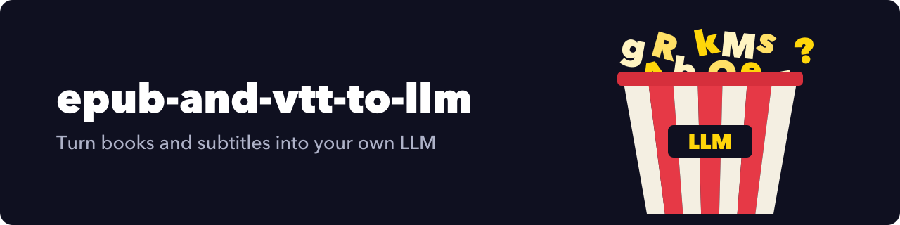

<p align="center">
  
</p>

<h1 align="center">epub-and-vtt-to-llm</h1>

<p align="center">
  Given .epub and .vtt files, train and infer a new LLM.
</p>

<p align="center"><a href="LICENSE"></a></p>

---

Python scripts that train LLMs from ePub books and VTT subtitle files. `process_epub.py` expects ePubs exported next to their `catalog.db` (the layout it unpacks), `process_vtt.py` expects a folder of `.vtt` files with the `S.json` and `media.db` metadata beside them; the `train_*.py` scripts fine-tune Qwen 2.5 1.5B, Llama 3.2 3B or Flan-T5 on the extracted text.

## Quick start

You need Python 3, an NVIDIA GPU (the requirements pin CUDA 12.4 wheels) and, for the Q/A generator, an OpenAI key set in `src/transform_text_to_questions.py` line 11. `process_vtt.py` and the training scripts read fixed `E:/...` paths at the top of each file; edit them before running.

```bash
pip install -r requirements.txt
python src/process_epub.py --directory /path/to/epubs --output epubs.json --catalog_db /path/to/epubs/catalog.db
python src/train_qwen-2_5-1_5B-Instruct.py
```

## Related projects

- [AskePub](https://github.com/GeiserX/AskePub): Telegram bot that annotates ePubs with GPT-4
- [ePubLangMerger](https://github.com/GeiserX/ePubLangMerger): merges two ePubs into one bilingual book for parallel reading

## License

[GPL-3.0-or-later](LICENSE)
